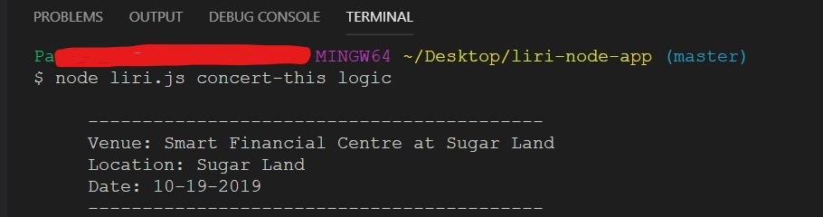
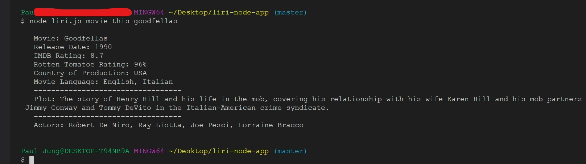
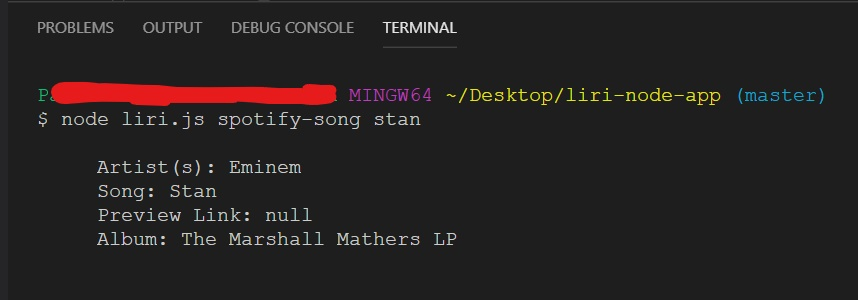
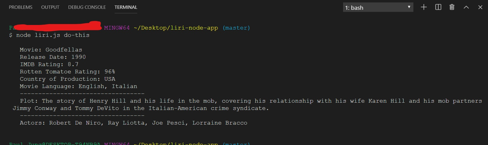

# Welcome to LiriBot!!!
If you like to look up random things LiriBot is here for you! Currently you can only search for four specific items....

## Getting Started
LiriBot is ran in the node.js terminal and you will have to  type the **command** *(process.argv[2])* first then the **item** *(process.argv[3])* you are searching for.

## Commands
1. **concert-this 'name of artist'** will search for the events for the artist:
* Name of the venue
* Venue Location
* Date of the Event

2. **movie-this 'name of movie'** will search for the movie:
* Title of the movie.
* Year the movie came out.
* IMDB Rating of the movie.
* Rotten Tomatoes Rating of the movie.
* Country where the movie was produced.
* Language of the movie.
* Plot of the movie.
* Actors in the movie.

3. **spotify-this-song 'name of song'** will seach for the song:
* Artist(s)
* The song's name
* A preview link of the song from Spotify
* The album that the song is from

4.**do-this** will aquire the text in random.txt and run whatever is in the file. You will not need to put a search item after the command for this command.

## More Updates to Come!
Thank you for stopping by. LiriBot will always be learning to provide you with more things to look up so make sure to say "hello" to LiriBot from time to time.
